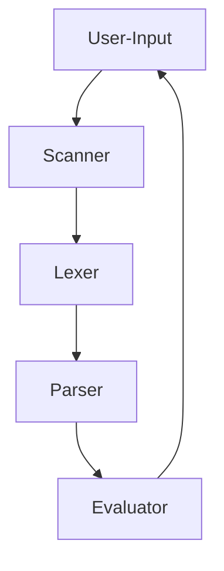

# CLI Arithmetic Evaluator

### What?

Appears to be a calculator, but is in fact a way for me to test and learn the
depths of Rust's core concepts like scanning, lexing, parsing, and other fundementals
behind compiler design. If you are using this as a learning experience as I am
you will find I have commented extensively.
 
You can learn more about systems programming in rust including the code I used here via _Practical Systems Programming for Rust Developers_ .

## Project Requirements

- user should be able to input into command line as normal/free text
- valid input should return correct calculations
- invalid input should return error message
- handle edge cases like empty "()"

##### Flowchart

1. User-Input - user can enter arithmetic expression (no spaces) into CLI
2. Scanner - read the expression
3. lexer - create tokens from expression
4. parser - parse tokens into AST
5. evaluate - calculate value from AST, return to CLI
