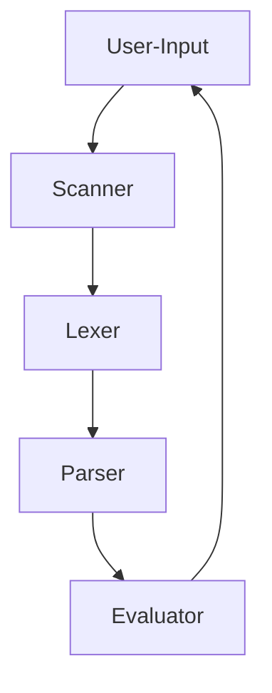

# CLI Arithmetic Evaluator

Appears to be a calculator, but is in fact a way for me to test the depths of Rust's core concepts like scanning, lexing, parsing, and other fundementals behind compiler design.

## Project Requirements

- user should be able to input into command line as normal/free text
- valid input should return correct calculations
- invalid input should return error message
- handle edge cases like empty "()"

##### Flowchart

1. User-Input - user can enter arithmetic expression (no spaces) into CLI
2. Scanner - read the expression
3. lexer - create tokens from expression
4. parser - parse tokens into AST
5. evaluate - calculate value from AST, return to CLI
